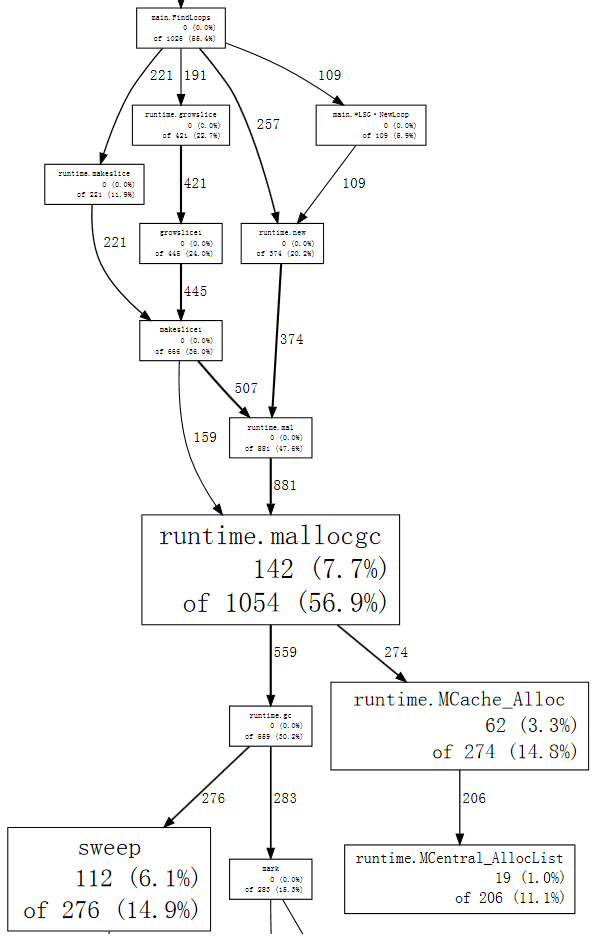

### 1. The Entry Point: `main.FindLoops`

This is your "Primary Suspect."

* **Explanation:** "In this graph, `main.FindLoops` is responsible for **56.4%** of the total allocations. It isn't doing the work itself (0.0% flat), but it is the 'Manager' directing traffic to the workers like `makeslice` and `newobject`."

### 2. The Workers: `makeslice` and `growslice`

These are the functions that were triggered when you ran `make([]int, 10_000_000)` in your earlier code.

* **Explanation:** "When we see `makeslice` and `growslice`, we know the program is dealing with dynamic arrays (slices). `growslice` is particularly important—it means our slices were too small, and Go had to stop and 'resize' them to fit more data. This is a common performance bottleneck."

### 3. The "Bottleneck": `runtime.mallocgc`

Notice how almost every path leads to `mallocgc`.

* **Explanation:** "This is the **Go Memory Allocator**. It’s the gatekeeper. **56.9%** of our program's time or memory footprint is flowing through this one function. If this number is high, it means our program is 'allocation heavy'."

### 4. The Consequence: `runtime.gc`

Follow the arrows from `mallocgc` to `runtime.gc`.

* **Explanation:** "This is the most critical part of the graph. Because we are allocating so much memory in `mallocgc`, it is triggering the **Garbage Collector (`runtime.gc`)**. You can see the GC then splits into `sweep` and `mark` (the cleanup crew). This graph proves that our `FindLoops` function is the reason the CPU is busy cleaning up trash instead of running our logic."

---

### How to explain this to a Senior/Interviewer

"If I look at this `pprof` graph, I see a clear **allocation chain**. `main.FindLoops` is calling `makeslice` and `growslice`, which eventually lands in `mallocgc`.

The motive for looking at this is to find **optimization targets**. For example:

1. **Pre-allocation:** Since `growslice` is showing up with **22.7%**, we can optimize `FindLoops` by pre-allocating the slice capacity so it doesn't have to keep growing.
2. **Object Reuse:** Since `runtime.new` and `runtime.mal` are high, we might consider using a `sync.Pool` to reuse objects instead of creating new ones.

This graph essentially tells us: **'Fix the way `FindLoops` handles slices, and you'll reduce the work for the Garbage Collector by 30-50%.'**"

---

### Summary of the Terms (The "Human" Version)

* **`mallocgc`**: The person handing out memory.
* **`makeslice`**: Creating a new list.
* **`growslice`**: Realizing the list is too small and moving to a bigger one (expensive!).
* **`sweep` / `mark**`: The Garbage Collector looking for trash and throwing it away.

Does this "chain of command" help you see how your code's performance is actually mapped out by the computer?